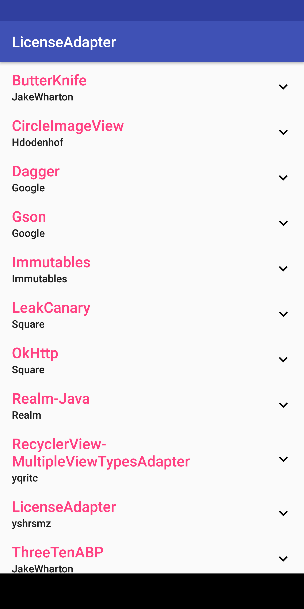
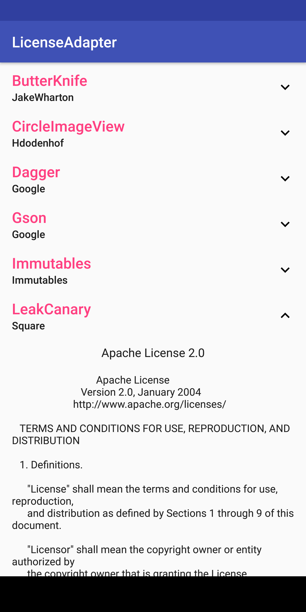

# LicenseAdapter

[](https://travis-ci.org/yshrsmz/LicenseAdapter)
[](https://android-arsenal.com/details/1/3516)
[](https://bintray.com/yshrsmz/maven/licenseadapter/_latestVersion)

LicenseAdapter is an easy-to-use library that provides a RecyclerView
adapter to display OSS dependencies and their associated licenses.




## Table of contents

- [Installation](#installation)
- [Usage](#usage)
  - [Predefined license names](#predefined-license-names)
  - [Predefined license file names](#predefined-license-file-names)
- [Apps using LicenseAdapter](#apps-using-licenseadapter)
- [License](#license)

## Installation

LicenseAdapter is distributed via JCenter:
[](https://bintray.com/yshrsmz/maven/licenseadapter/_latestVersion)

```gradle
dependencies {
  implementation 'net.yslibrary.licenseadapter:licenseadapter:LATEST_LIBRARY_VERSION'
}
```

## Usage

```java
// Create list of libraries
List<Library> libraries = new ArrayList<>();

// Add libraries that are hosted on GitHub with an Apache v2 license.
libraries.add(Licenses.fromGitHubApacheV2("realm/realm-java"));
libraries.add(Licenses.fromGitHubApacheV2("square/retrofit"));

// BSD license
libraries.add(Licenses.fromGitHubBSD("bumptech/glide"));

// MIT license
libraries.add(Licenses.fromGitHubMIT("jhy/jsoup"));

// Library that is hosted on GitHub, but does not provide license text.
libraries.add(Licenses.fromGitHub("gabrielemariotti/changeloglib", Licenses.LICENSE_APACHE_V2));

// Library that is not hosted on GitHub.
libraries.add(Licenses.noContent("Android SDK", "Google Inc.", "https://developer.android.com/sdk/terms.html"));

// Library that does not have their license online
libraries.add(Licenses.noLink("Google Play Services", "Google Inc.", GoogleApiAvailability.getInstance().getOpenSourceSoftwareLicenseInfo(this)));

// These 2 licenses are on a branch name other than master
libraries.add(Licenses.fromGitHubApacheV2("ReactiveX/RxAndroid", "2.x/" + Licenses.FILE_AUTO));
libraries.add(Licenses.fromGitHubApacheV2("ReactiveX/RxJava", "2.x/" + Licenses.FILE_AUTO));

// Create and display the adapter
RecyclerView rv = findViewById(R.id.list);
rv.setLayoutManager(new LinearLayoutManager(this));
rv.setAdapter(new LicenseAdapter(libraries)); // It's that simple!
```

Don't forget to add the `android.permission.INTERNET` permission to your
manifest.

### Predefined license names

License name | Field
--- | ---
Apache License 2.0 | `Licenses#NAME_APACHE_V2`
MIT License | `Licenses#NAME_MIT`
BSD License | `Licenses#NAME_BSD`

### Predefined license file names

License file name | Field
--- | ---
Automatically find the license file from the predefined set below | `Licenses#FILE_AUTO`
`LICENSE` | `Licenses#FILE_NO_EXTENSION`
`LICENSE.txt` | `Licenses#FILE_TXT`
`LICENSE.md` | `Licenses#FILE_MD`

## Apps using LicenseAdapter

Send PR if you want your app to be included here ;)

- [Omnitweety](https://play.google.com/store/apps/details?id=net.yslibrary.omnitweety)
- [KyudoScoreBookTeam](https://play.google.com/store/apps/details?id=com.bowyer.app.android.kyudoscoreteam)
- [KyudoScoreBook](https://play.google.com/store/apps/details?id=com.bowyer.KyudoScoreBookSecond)
- [Ameba](https://play.google.com/store/apps/details?id=jp.ameba)
- [Monotweety](https://play.google.com/store/apps/details?id=net.yslibrary.monotweety)
- [🤖 Robot Scouter](https://play.google.com/store/apps/details?id=com.supercilex.robotscouter)

## License

    Copyright 2016-2017 Shimizu Yasuhiro (yshrsmz)

    Licensed under the Apache License, Version 2.0 (the "License");
    you may not use this file except in compliance with the License.
    You may obtain a copy of the License at

       http://www.apache.org/licenses/LICENSE-2.0

    Unless required by applicable law or agreed to in writing, software
    distributed under the License is distributed on an "AS IS" BASIS,
    WITHOUT WARRANTIES OR CONDITIONS OF ANY KIND, either express or implied.
    See the License for the specific language governing permissions and
    limitations under the License.
