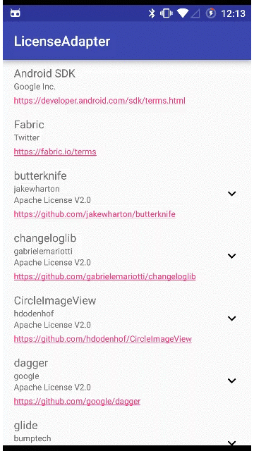
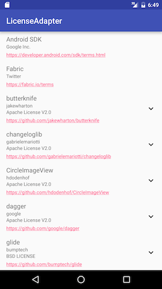
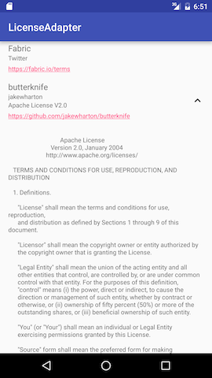

LicenseAdapter
===

[](https://travis-ci.org/yshrsmz/LicenseAdapter)
[](https://android-arsenal.com/details/1/3516)
[](https://bintray.com/yshrsmz/maven/licenseadapter/view)

Adapter library for RecyclerView to display your app's OSS dependencies.

This library fetch license text from GitHub(and your custom location), so technically this library is capable of displaying any license.






## Installation

LicenseAdapter is distributed via jCenter. [](https://bintray.com/yshrsmz/maven/licenseadapter/view)

```gradle
dependencies {
  compile 'net.yslibrary.licenseadapter:licenseadapter:LATEST_LIBRARY_VERSION'
}
```


## Usage


Don't forget to add `android.permission.INTERNET` permission to your AndroidManifest.


```java
// create list of licenses
List<LicenseEntry> dataset = new ArrayList<>();

// library that is not hosted on GitHub
dataset.add(Licenses.noContent("Android SDK", "Google Inc.", "https://developer.android.com/sdk/terms.html"));

// library that is hosted on GitHub, but does not provide license text
dataset.add(Licenses.fromGitHub("gabrielemariotti/changeloglib", Licenses.LICENSE_APACHE_V2));

// Apache v2 library that is hosted on GitHub
dataset.add(Licenses.fromGitHubApacheV2("realm/realm-java"));
dataset.add(Licenses.fromGitHubApacheV2("square/retrofit"));

// BSD library that is hosted on GitHub
dataset.add(Licenses.fromGitHubBSD("bumptech/glide"));

// MIT library that is hosted on GitHub
dataset.add(Licenses.fromGitHubMIT("jhy/jsoup"));

// these 2 licenses have different branch name
dataset.add(new GitHubLicenseEntry(Licenses.NAME_APACHE_V2, "ReactiveX/RxAndroid", "2.x/", null, Licenses.FILE_AUTO));
dataset.add(new GitHubLicenseEntry(Licenses.NAME_APACHE_V2, "ReactiveX/RxJava", "2.x/", null, Licenses.FILE_AUTO));

// create adapter
LicenseAdapter adapter = new LicenseAdapter(dataset);
RecyclerView list = (RecyclerView) findViewById(R.id.list);
list.setLayoutManager(new LinearLayoutManager(this, LinearLayoutManager.VERTICAL, false));
list.setAdapter(adapter);

// finally load license text from Web
Licenses.load(dataset);
```


## Predefined License name strings

License name | Actual variable
--- | ---
Apache License V2.0 | Licenses#NAME_APACHE_V2
MIT LICENSE | Licenses#NAME_MIT
BSD LICENSE | Licenses#NAME_BSD


## Predefined License file name

License file name | Actual variable
--- | ---
Automatically find the license file from the predefined set below | Licenses#FILE_AUTO
LICENSE | Licenses#FILE_NO_EXTENSION
LICENSE.txt | Licenses#FILE_TXT
LICENSE.md | Licenses#FILE_MD


## Apps using LicenseAdapter

Send PR if you want your app to be included here ;)

- [Omnitweety](https://play.google.com/store/apps/details?id=net.yslibrary.omnitweety)
- [KyudoScoreBookTeam](https://play.google.com/store/apps/details?id=com.bowyer.app.android.kyudoscoreteam)
- [KyudoScoreBook](https://play.google.com/store/apps/details?id=com.bowyer.KyudoScoreBookSecond)
- [Ameba](https://play.google.com/store/apps/details?id=jp.ameba)
- [Monotweety](https://play.google.com/store/apps/details?id=net.yslibrary.monotweety)

## License

    Copyright 2016-2017 Shimizu Yasuhiro (yshrsmz)

    Licensed under the Apache License, Version 2.0 (the "License");
    you may not use this file except in compliance with the License.
    You may obtain a copy of the License at

       http://www.apache.org/licenses/LICENSE-2.0

    Unless required by applicable law or agreed to in writing, software
    distributed under the License is distributed on an "AS IS" BASIS,
    WITHOUT WARRANTIES OR CONDITIONS OF ANY KIND, either express or implied.
    See the License for the specific language governing permissions and
    limitations under the License.
